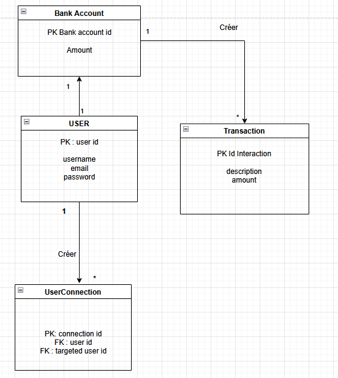

# PayMyBuddy
## A solution to transfer money easily with friends

<p align="center">
  <a href="https://spring.io/projects/spring-boot">
    
  </a>
  <a href="https://www.thymeleaf.org/">
    
  </a>
  <a href="https://www.postgresql.org/">
    
  </a>
</p>


Pay My Buddy is a website that allows users to transfer money between people by simply adding their email address.

## Features

- Sign in with an email address, username, and a protected password.
- Add friends already registered with their email.
- Add money or withdraw from your bank.
- Transfer the chosen amount or receive it from a friend.
- Consult the list of past transactions.
- Modify your personal information if needed.
- Each transaction is charged a 0.5% fee, paid by the sender.

## MPD



## Tech

PayMyBuddy uses several open-source technologies:

- [Spring Boot](https://spring.io/) - A secure and robust Java framework.
- [Thymeleaf](https://www.thymeleaf.org/) - A modern server-side Java template engine.
- [PostgreSQL](https://www.postgresql.org/) - A powerful relational database system.
- [Bootstrap](https://getbootstrap.com/) - A great UI boilerplate for modern web apps.

## Prerequisites

- Java 21 (download [here](https://openjdk.org/projects/jdk/21/))
- Maven installed
- PostgreSQL database running

## Installation

1. **Clone the repository**
   ```sh
   git clone https://github.com/Letho13/PayMyBuddy.git
   cd PayMyBuddy
